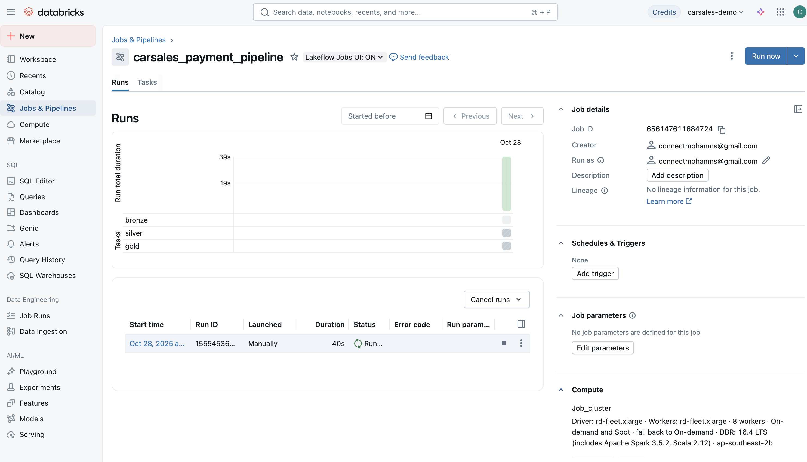
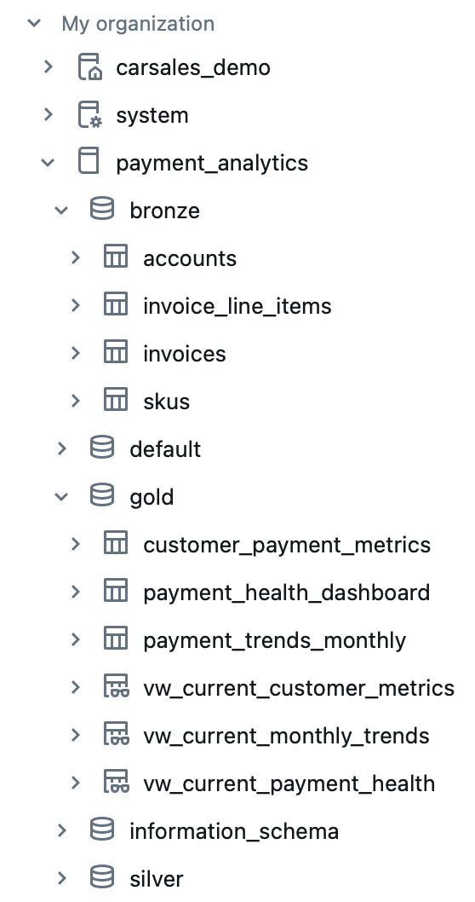
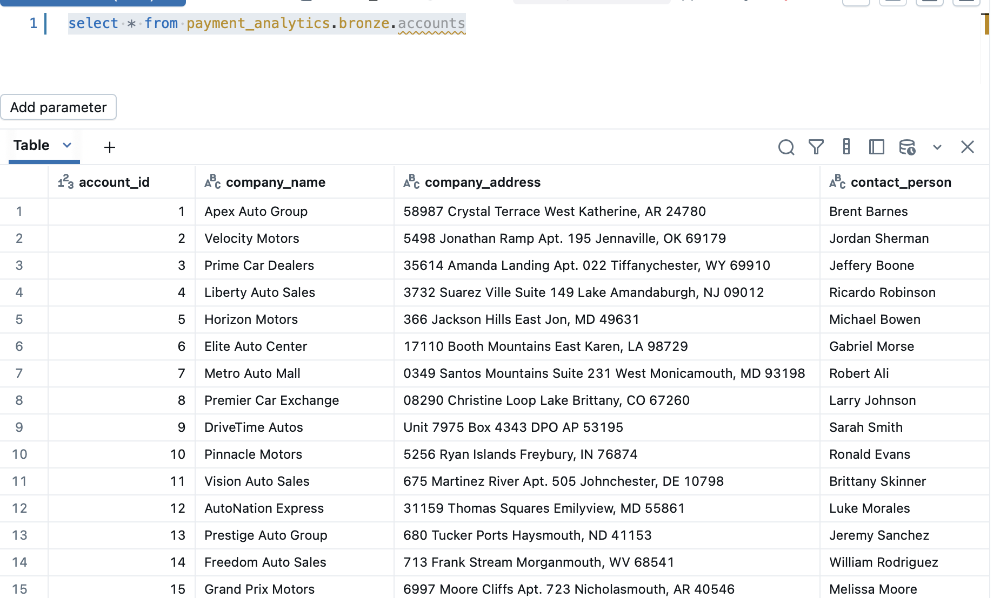
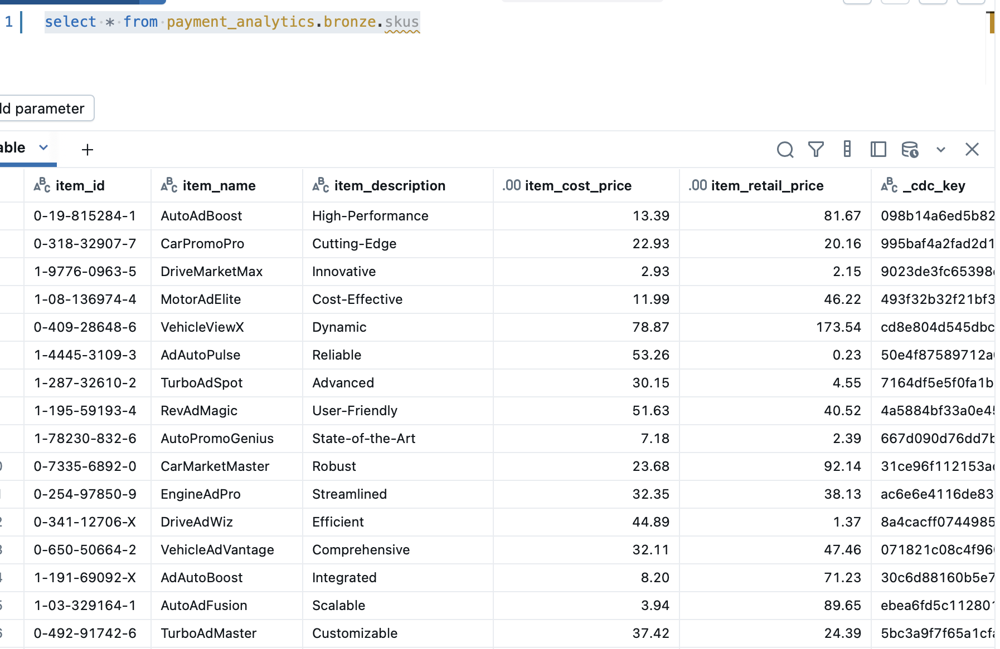
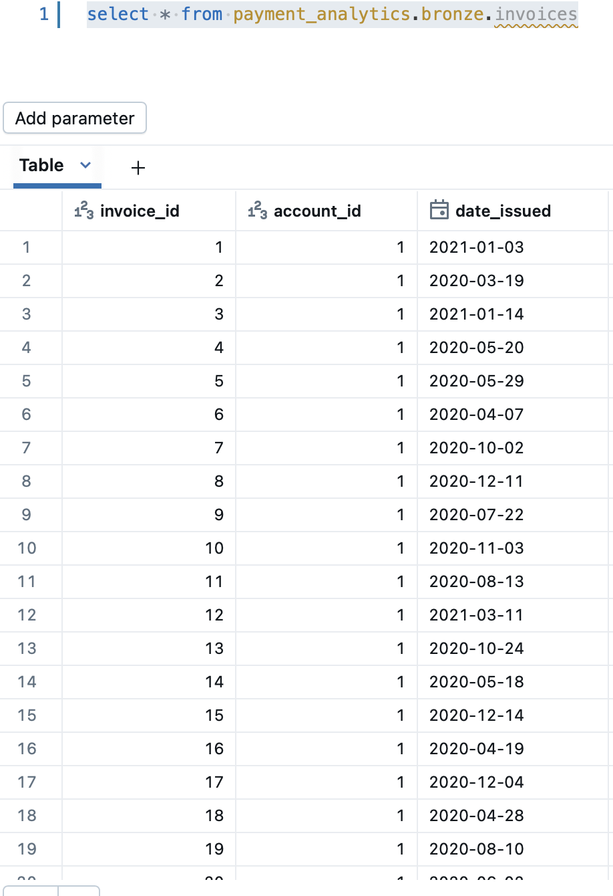
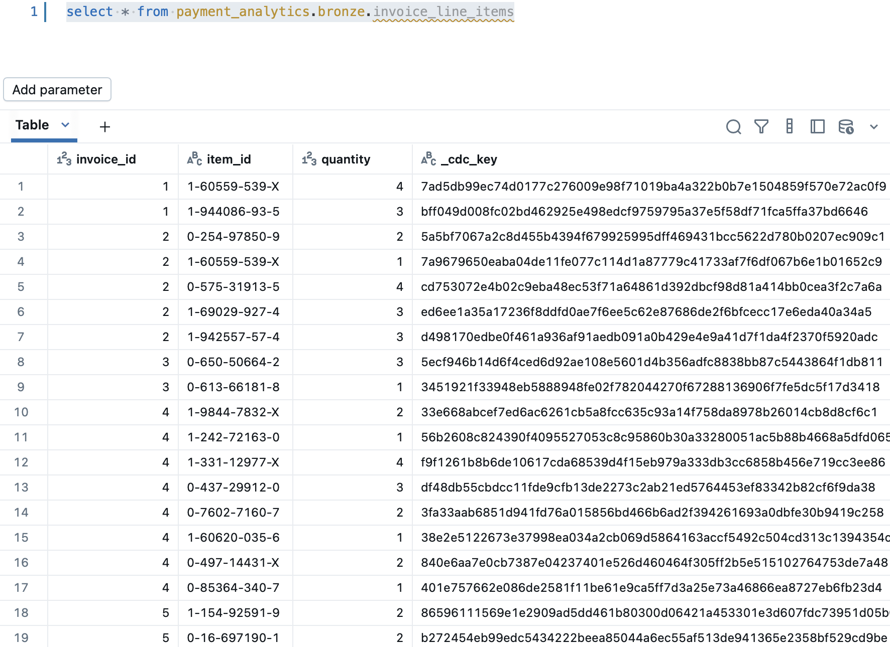
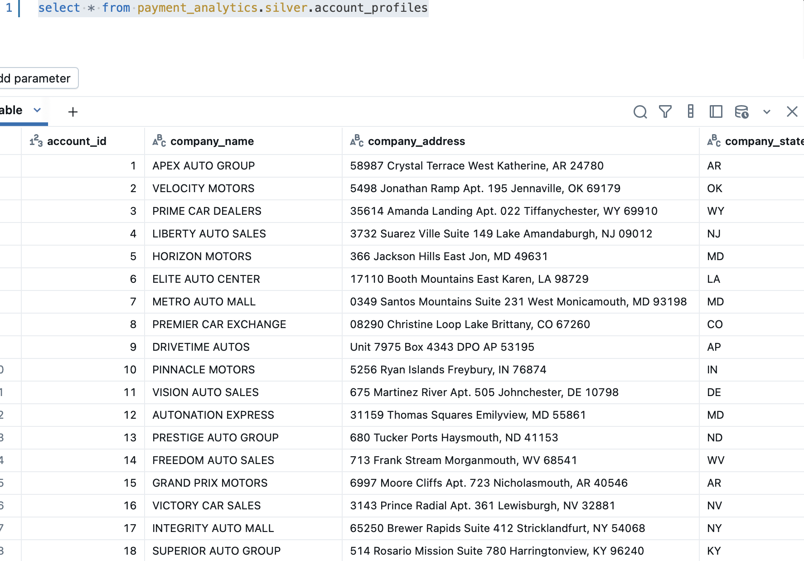
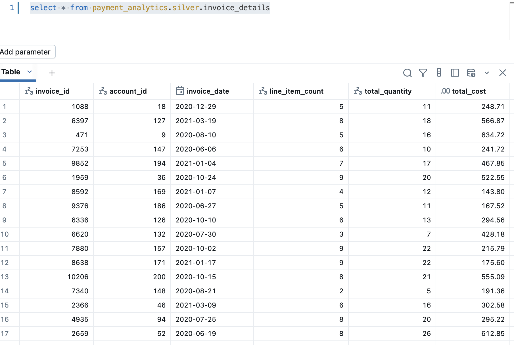
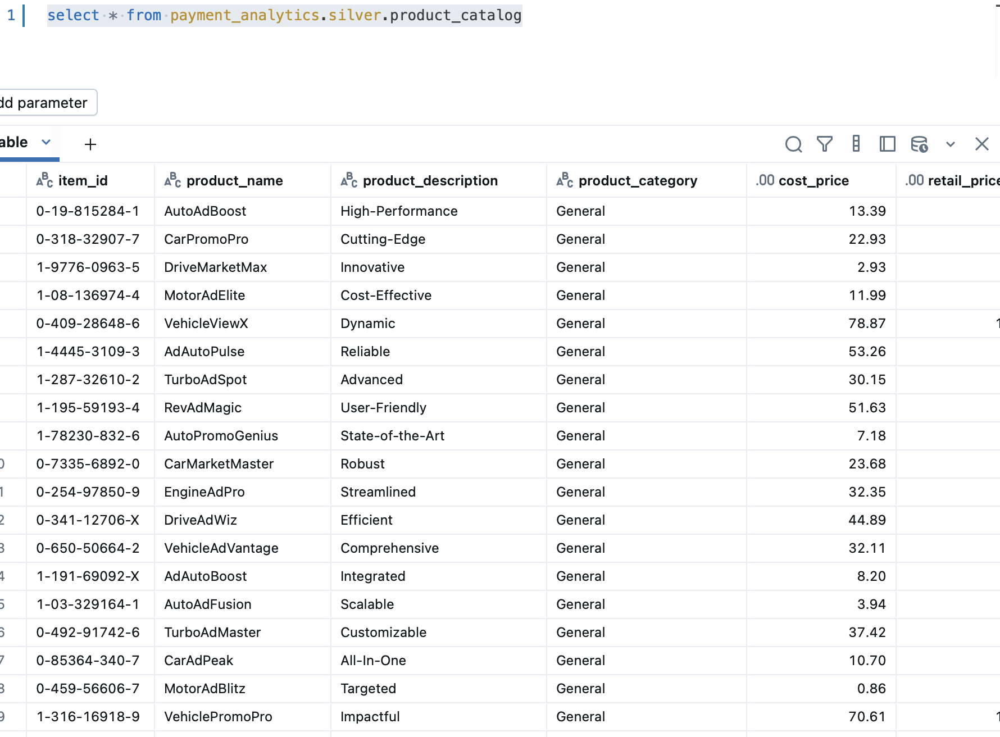
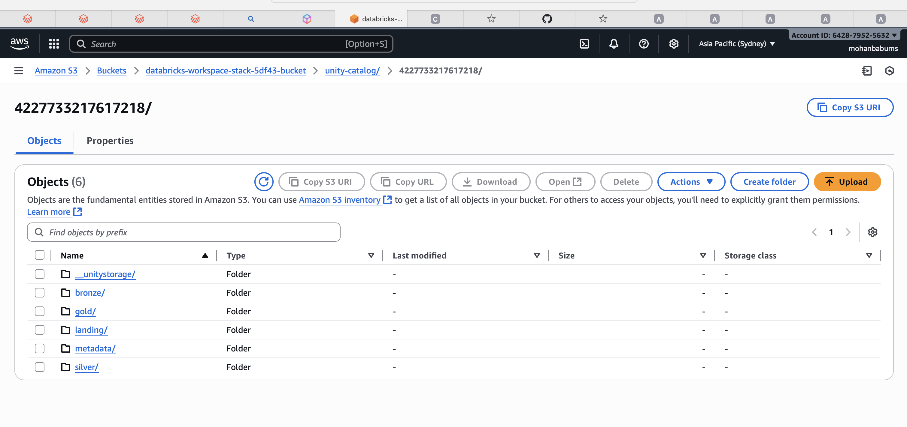

# Databricks Medallion Architecture - Payment Analytics Platform

# Bronze-Silver-Gold with SCD Type 2


1. [Architecture Overview]
2. [Bronze Layer - Raw & Historical]
3. [Silver Layer - Cleansed & Enriched]
4. [Gold Layer - Business Metrics]

---

### Business Problem: Manual payment tracking → Automated risk scoring
### Bronze Layer: Raw data with history for pattern analysis
### Silver Layer: Clean features for ML/analytics (days to pay, payment history)
### Gold Layer: Daily risk scores and actionable dashboards
### SCD Type 2: Track changes that correlate with late payments
### Predictive Features: Payment behavior + customer profiles
### Risk Scoring: Real-time calculation with clear actions
### Data Quality: Gates to prevent bad data corrupting predictions
### Cost Optimization: Partitioning + denormalization strategies
### Scaling: Metadata-driven automation

---

## Architecture Overview

### Medallion Architecture Pattern

The implementation follows Databricks' recommended three-layer medallion architecture:

```
AWS S3 Landing → Bronze (Raw) → Silver (Cleansed) → Gold (Business)
```

### Key Components

| Component | Technology | Purpose |
|-----------|-----------|---------|
| **Source** | AWS S3 | CSV files in landing zone |
| **Storage** | Delta Lake | ACID transactions
| **Processing** | PySpark | Distributed data processing |
| **Metadata** | YAML | Configuration-driven pipelines |
| **Orchestration** | Databricks Notebooks | MWAA - AIRFLOW |
| **Monitoring** | AWS CloudWatch | Logging and alerting |

### Data Sources

- `invoices.csv` - Invoice headers
- `accounts.csv` - Customer accounts
- `skus.csv` - Product catalog
- `invoice_line_items.csv` - Line item details

**Full historical tracking via SCD Type 2**

### Framework Configuration

#### AWS Credentials (Databricks Secrets)

```python
# Store in Databricks Secrets
dbutils.secrets.put(
    scope="aws-credentials",
    key="cloudwatch-access-key-id",
    value="AKIA..."
)

dbutils.secrets.put(
    scope="aws-credentials",
    key="cloudwatch-secret-access-key",
    value="secret..."
)
```

#### Widget Parameters

```python
# Bronze Orchestrator
dbutils.widgets.text("metadata_path", 
    "s3://bucket/metadata/bronze/")
dbutils.widgets.text("table_list", 
    "invoices,accounts,skus,invoice_line_items")
dbutils.widgets.text("environment", "dev")
```

---

## Deployment Guide

### Prerequisites

1. **Databricks Workspace**
   - Runtime: DBR 13.0+ with Unity Catalog
   - Cluster configuration: Standard_DS3_v2 or higher

2. **AWS Resources**
   - S3 buckets for landing, bronze, silver, gold
   - IAM roles with appropriate permissions
   - CloudWatch for logging - PENDING

3. **Python Packages**
   ```
   pyspark==3.5.0
   pyyaml==6.0
   boto3==1.28.0
   ```

### Deployment Steps

#### Step 1: Upload Files to Databricks

#### Step 2: Upload Metadata to S3

#### Step 3: Configure Databricks Secrets

```python
# In Databricks notebook
dbutils.secrets.createScope(scope="aws-credentials")

dbutils.secrets.put(
    scope="aws-credentials",
    key="cloudwatch-access-key-id",
    value="your-access-key"
)

dbutils.secrets.put(
    scope="aws-credentials",
    key="cloudwatch-secret-access-key",
    value="your-secret-key"
)
```

#### Step 4: Create Databricks Job

### Running the Pipeline

#### Manual Execution

```python
# In Databricks notebook

# 1. Bronze Layer
%run /Users/<email>/notebooks/bronze_orchestrator
# Set widgets: metadata_path, table_list="all", environment="dev"

# 2. Silver Layer
%run /Users/<email>/notebooks/silver_orchestrator
# Set widgets as above

# 3. Gold Layer
%run /Users/<email>/notebooks/gold_orchestrator
# Set widgets as above
```

#### Scheduled Execution

- Databricks Jobs integrated with Airflow - MWAA

### Monitoring

#### Success Metrics

Check the orchestrator output:
```
================================================================================
BRONZE LAYER INGESTION SUMMARY
================================================================================
Total Tables: 4
  Success: 4
  Failed: 0
  Skipped: 0

#### Failure Handling

If any table fails:
1. Check logs for specific error
2. Verify metadata YAML syntax
3. Check source data quality
4. Review data quality rule violations

---

## Best Practices

### 1. SCD Type 2 Management

- **Use compare_columns wisely**: Only include columns that matter for business
- **Regular cleanup**: Archive old versions after retention period

### 2. Data Quality

- **Reject vs Flag**: Use `action: reject` for critical rules, `action: flag` for warnings
- **Incremental improvement**: Started with basic rules, add more over time
- **Monitor pass rates**: Alert when DQ pass rate drops below threshold

### 3. Performance Optimization

- **Partition strategically**: Use date-based partitions for time-series data
- **Secrets management**: Never hardcode credentials
- **Column-level security**: Use Unity Catalog for data masking - PENDING 
- **Audit logging**: Enable CloudWatch integration - PENDING

---

#### Data Quality Failures

**Error:**
```
Data quality check failed: 25% pass rate
```

TO be REVIEWED:
1. Review rejected records
2. Adjust rules if too strict
3. Fix source data quality

---


### A. Complete File Structure

```
project/
├── notebooks/
│   ├── bronze_ingestion_framework.py
│   ├── bronze_orchestrator.py
│   ├── silver_transformation_framework.py
│   ├── silver_orchestrator.py
│   ├── gold_transformation_framework.py
│   └── gold_orchestrator.py
│
├── metadata/
│   ├── bronze/
│   │   ├── invoices/invoices.yaml
│   │   ├── accounts/accounts.yaml
│   │   ├── skus/skus.yaml
│   │   └── invoice_line_items/invoice_line_items.yaml
│   ├── silver/
│   │   ├── account_profiles/account_profiles.yaml
│   │   ├── invoice_details/invoice_details.yaml
│   │   └── product_catalog/product_catalog.yaml
│   └── gold/
│       ├── customer_payment_metrics/customer_payment_metrics.yaml
│       ├── payment_trends_monthly/payment_trends_monthly.yaml
│       └── payment_health_dashboard/payment_health_dashboard.yaml
│
└── landing/
    ├── invoices/
    ├── accounts/
    ├── skus/
    └── invoice_line_items/
```

## Summary

This implementation provides a metadata-driven data pipeline** with:

**Three-layer medallion architecture** (Bronze → Silver → Gold)  
**Full SCD Type 2 history tracking** with audit trails  
**AWS S3 and Databricks integration**  

### Databricks:

##Workflow:



## Tables:


## BRONZE:
# Account:

# SKUS:

# Invoices

# Line Items:


## Silver:

## Account profiled

## Invoice Detailed

## Product Catalog


## AWS Layer:



